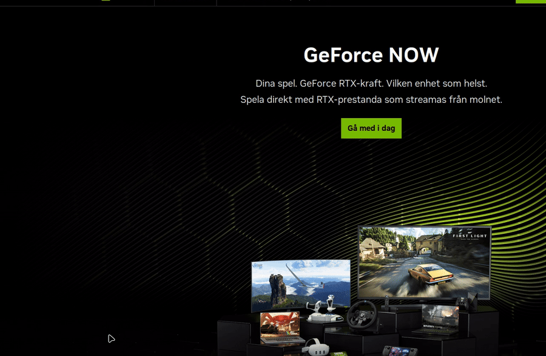

# ImWebBrowser

A minimal, GPU-accelerated web browser built on
[WPE WebKit](https://wpewebkit.org/), [Dear ImGui](https://github.com/ocornut/imgui)
and [SDL3](https://github.com/libsdl-org/SDL). The page is composited by the WPE
web process into native dmabuf/EGL buffers that the host imports and renders
through a Vulkan or OpenGL ES backend, so the rendering stays on the GPU for the
whole pipeline.

The UI chrome (back / forward / reload / kiosk, address bar and a fixed-width
loading-progress indicator) is drawn with Dear ImGui on top of the web-view
texture. The OS window title mirrors the live page title.

## Demo



The web process composites the page into dmabuf/EGL buffers that the host renders
through OpenGL ES, here showing the dark GeForce NOW marketing page with the
toolbar (Back / Fwd / Reload / Kiosk, address bar, loading-progress).

## Status

Tested on a Lenovo ThinkPad W540 (Intel HD 4600, crocus) running Linux Mint 22.3
with Mesa 25.2.8 and WPE WebKit 2.38. Real content renders and is interactive on:

- YouTube
- GeForce Now (`play.geforcenow.com` and the `nvidia.com` marketing pages)
- Netflix
- Google Docs

The keyboard layout follows the system XKB keymap (Swedish on the test machine).

Primary deployment target: **STM32MP2 microprocessors** (Arm Cortex-A35 +
VeriSilicon GC7000). The codebase is architecture-neutral and cross-compiles from an
x86-64 host; see [Cross-compiling for STM32MP2](#cross-compiling-for-stm32mp2).

## Build

> Build with a single job on constrained machines:
>
>     cmake --build build --parallel 1
>
> Parallel builds (`-j2` and above) can OOM / wedge low-RAM machines.

### Build dependencies (Debian/Ubuntu)

    sudo apt install build-essential cmake pkg-config libsdl3-dev \
        libwpe-1.0-dev libwpebackend-fdo-1.0-dev libwpewebkit-1.1-dev \
        libglib2.0-dev libegl-dev libgles2-dev libwayland-dev

For the optional Vulkan backend: `libvulkan-dev`.

### Configure and build

    cmake -S . -B build -DCMAKE_BUILD_TYPE=Release
    cmake --build build --parallel 1

### CMake options

| Option | Default | Effect |
| ------ | ------- | ------ |
| `IMWEBBROWSER_BACKEND_VULKAN` | `OFF` | Render the web view through Vulkan |
| `IMWEBBROWSER_BACKEND_OPENGL_ES` | `ON` | Render the web view through OpenGL ES |
| `IMWEBBROWSER_ENABLE_JAVASCRIPT` | `ON` | Enable JavaScript in web pages |
| `IMWEBBROWSER_ENABLE_WEBGL` | `ON` | Enable WebGL |
| `IMWEBBROWSER_ENABLE_WEBRTC` | `ON` | Enable WebRTC |
| `IMWEBBROWSER_ENABLE_MEDIA` | `ON` | Enable HTML audio/video playback |
| `IMWEBBROWSER_ENABLE_MEDIA_STREAM` | `ON` | Enable `getUserMedia` capture |
| `IMWEBBROWSER_ENABLE_WEB_AUDIO` | `ON` | Enable Web Audio |
| `IMWEBBROWSER_ENABLE_FULLSCREEN` | `ON` | Allow web pages to request fullscreen |
| `IMWEBBROWSER_ENABLE_DEVELOPER_EXTRAS` | `OFF` | Enable the Web Inspector |
| `IMWEBBROWSER_ENABLE_SANDBOX` | `ON` | Enable the WebKit sandbox |
| `IMWEBBROWSER_ENABLE_SMOOTH_SCROLLING` | `ON` | Prefer smooth pixel axis scrolling |
| `IMWEBBROWSER_ENABLE_ENCRYPTED_MEDIA` | `ON` | Enable Encrypted Media Extensions (DRM) |
| `IMWEBBROWSER_ENABLE_PAGE_CACHE` | `ON` | Enable the back/forward page cache |
| `IMWEBBROWSER_ENABLE_DNS_PREFETCHING` | `ON` | Enable DNS prefetching of links |
| `IMWEBBROWSER_ENABLE_SPATIAL_NAVIGATION` | `OFF` | Enable arrow-key spatial navigation |
| `IMWEBBROWSER_ENABLE_CARET_BROWSING` | `OFF` | Enable caret browsing mode |
| `IMWEBBROWSER_ENABLE_TABS_TO_LINKS` | `ON` | Allow Tab to focus page links |
| `IMWEBBROWSER_ENABLE_XSS_AUDITOR` | `ON` | Enable the XSS auditor |
| `IMWEBBROWSER_ENABLE_SITE_SPECIFIC_QUIRKS` | `ON` | Apply per-site compatibility quirks |
| `IMWEBBROWSER_ENABLE_OFFLINE_APP_CACHE` | `OFF` | Enable the legacy offline app cache |
| `IMWEBBROWSER_ENABLE_FRAME_FLATTENING` | `OFF` | Flatten embedded frames to page width |
| `IMWEBBROWSER_ENABLE_PLUGINS` | `OFF` | Enable plugins (NPAPI) |
| `IMWEBBROWSER_ENABLE_JAVA` | `OFF` | Enable Java support |
| `IMWEBBROWSER_ENABLE_HTML5_DATABASE` | `ON` | Enable HTML5 databases |
| `IMWEBBROWSER_ENABLE_HYPERLINK_AUDITING` | `OFF` | Enable hyperlink auditing (ping) |
| `IMWEBBROWSER_ENABLE_RESIZABLE_TEXT_AREAS` | `ON` | Allow text areas to be resized |
| `IMWEBBROWSER_ENABLE_MOCK_CAPTURE_DEVICES` | `OFF` | Enable mock capture devices |
| `IMWEBBROWSER_ENABLE_CONSOLE_TO_STDOUT` | `OFF` | Write page console messages to stdout |
| `IMWEBBROWSER_ENABLE_ACCELERATED_2D_CANVAS` | `ON` | Enable accelerated 2D canvas |
| `IMWEBBROWSER_TRACE_LOGGING` | `OFF` | Compile with trace-level logging |
| `IMWEBBROWSER_INSTALL` | `ON` | Install the `imwebbrowser` binary |

Note: a few toggles (plugins, Java, offline app cache, mock capture devices) are
no-ops if the distro's `libwpewebkit` was built without those features.

## Cross-compiling for STM32MP2

ImWebBrowser targets STMicroelectronics STM32MP2 (STM32MP25x) boards running
OpenSTLinux: Arm Cortex-A35 CPU and a VeriSilicon GC7000 GPU driven by Mesa's Etnaviv
(OpenGL ES 3.1) or V3DV (Vulkan 1.3). Nothing in the code is
architecture-specific, so the same sources cross-compile from any x86-64 host.

### Target runtime dependencies

The STM32MP2 sysroot must provide these packages (from the OpenSTLinux/Yocto
BSP or your distro's `lib`/`-dev` packages):

| Component        | Purpose                                            |
| ---------------- | -------------------------------------------------- |
| `libsdl3-dev`    | Window, input, GL context (X11/Wayland/KMSDRM)     |
| `libwpe-1.0-dev` | WPE base library                                   |
| `libwpebackend-fdo-1.0-dev` | Frame export (EGL image / dmabuf)       |
| `libwpewebkit-2.0-dev` (or `-1.1`) | WebKit engine                    |
| `libegl-dev` `libgles2-dev` | GLES 3.1 (Mesa/etnaviv)             |
| `libwayland-dev` | wpebackend-fdo + SDL3 Wayland backend              |
| `libxkbcommon-dev` | Keyboard layout                                   |
| `libglib2.0-dev` | GLib/gobject (WebKit + GLib main loop)             |
| `libvulkan-dev` (optional) | Only for `IMWEBBROWSER_BACKEND_VULKAN=ON`   |

### Option A — Yocto SDK cross-toolchain (recommended)

Install the OpenSTLinux SDK for STM32MP2 and source its environment script so
`OECORE_TARGET_SYSROOT` and the target `pkg-config` are on PATH:

    source /opt/st/stm32mp2/<ver>/environment-setup-cortexa35-poky-linux

Then configure with the bundled toolchain file:

    cmake -S . -B build-stm32mp2 \
        -DCMAKE_TOOLCHAIN_FILE=cmake/toolchains/STM32MP2-armv8a.cmake \
        -DCMAKE_BUILD_TYPE=Release \
        -DIMWEBBROWSER_BACKEND_OPENGL_ES=ON
    cmake --build build-stm32mp2 --parallel 1

### Option B — standalone aarch64 toolchain + sysroot

    cmake -S . -B build-stm32mp2 \
        -DCMAKE_TOOLCHAIN_FILE=cmake/toolchains/STM32MP2-armv8a.cmake \
        -DSTM32MP2_SYSROOT=/path/to/stm32mp2/sysroot \
        -DSTM32MP2_CROSS_COMPILE=/usr/bin/aarch64-linux-gnu- \
        -DIMWEBBROWSER_BACKEND_OPENGL_ES=ON
    cmake --build build-stm32mp2 --parallel 1

(St's own SDK uses the `aarch64-ostl-linux-gnu-` prefix; pass it via
`-DSTM32MP2_CROSS_COMPILE=aarch64-ostl-linux-gnu-` if the plain
`aarch64-linux-gnu-` toolchain is not installed.)

### Deploying to the board

Copy `build-stm32mp2/imwebbrowser` to the target and run it on the X11 or
Wayland session (Weston) of the OpenSTLinux distribution. For a kiosk-style
embedded display use `--fullscreen`. Example:

    ./imwebbrowser --url https://example.com --fullscreen

The GLES backend renders the web view through the WPE EGL-image path; on
STM32MP2 the `SDL_HINT_VIDEO_FORCE_EGL` hint (set automatically) keeps the
SDL context on the same EGL display as WPE.

## Run

    ./build/imwebbrowser [options]

| Option | Description |
| ------ | ----------- |
| `-u, --url=<url>` | URL to open on startup |
| `--width=<px>` / `--height=<px>` | Initial window size |
| `--fullscreen` | Start fullscreen |
| `--user-agent=<str>` | Custom user agent string |
| `--no-javascript` | Disable JavaScript |
| `--no-webgl` | Disable WebGL |
| `--no-webrtc` | Disable WebRTC |
| `--no-media` | Disable HTML audio/video |
| `--no-media-stream` | Disable `getUserMedia` capture |
| `--no-web-audio` | Disable Web Audio |
| `--no-fullscreen-api` | Disable the Fullscreen API |
| `--developer-extras` | Enable the Web Inspector |
| `--no-sandbox` | Disable the WebKit sandbox |
| `--no-smooth-scrolling` | Use discrete (not smooth) wheel scrolling |
| `--no-encrypted-media` | Disable Encrypted Media Extensions (DRM) |
| `--no-page-cache` | Disable the back/forward page cache |
| `--no-dns-prefetching` | Disable DNS prefetching |
| `--no-spatial-navigation` | Disable arrow-key spatial navigation |
| `--no-caret-browsing` | Disable caret browsing mode |
| `--no-tabs-to-links` | Disable Tab focusing page links |
| `--no-xss-auditor` | Disable the XSS auditor |
| `--no-site-specific-quirks` | Disable per-site compatibility quirks |
| `--no-offline-app-cache` | Disable the legacy offline app cache |
| `--no-frame-flattening` | Disable frame flattening |
| `--no-plugins` | Disable plugins (NPAPI) |
| `--no-java` | Disable Java support |
| `--no-html5-database` | Disable HTML5 databases |
| `--no-hyperlink-auditing` | Disable hyperlink auditing (ping) |
| `--no-resizable-text-areas` | Disable text area resizing |
| `--no-mock-capture-devices` | Disable mock capture devices |
| `--no-console-to-stdout` | Do not write console messages to stdout |
| `--no-accelerated-2d-canvas` | Disable accelerated 2D canvas |
| `--log-level=<lvl>` | `trace` \| `debug` \| `info` \| `warn` \| `error` |

### Keyboard shortcuts

| Shortcut | Action |
| -------- | ------ |
| `F11` or the **Kiosk** button | Toggle kiosk (fullscreen, chrome-less) mode |
| `Esc` | Leave kiosk mode |
| `Ctrl+L` | Focus the address bar |
| `Ctrl+R` / `F5` | Reload |
| `Alt+Left` / `Alt+Right` | Back / forward |

## Source layout

```
src/
  main.cpp              Entry point + CLI
  application/          SDL3 window, renderer ownership, frame loop, shortcuts
  browser/              Browser state; reports the web-view viewport each frame
  config/               Runtime config + CLI parser
  input/                SDL3 -> WPE input translation (evdev keymap)
  logging/              Tiny leveled logger
  platform/             SDL3 window wrapper (fullscreen, DPI, drawable size)
  rendering/
    renderer.h          Backend-neutral frame sink / EGL display interface
    opengles/           OpenGL ES renderer; imports the WPE EGL image
    vulkan/             Vulkan renderer (optional, off by default)
    egl_helpers.*       EGL boilerplate shared by the backends
  ui/                   Dear ImGui toolbar + web-view quad
  webkit/               WebKitWebView + WPE FDO exportable; load/progress signals
  libraries/imgui/      Dear ImGui (vendored)
cmake/
  config_defaults.h.in  Template for the compile-time defaults header
```

## Renderer notes

The web process of WPE WebKit composites the page into a `wl_surface` and
exports each frame as a dmabuf (or, on the software path, a shared-memory
buffer). The host side of WPEBackend-fdo hands that buffer to the application as
an `EGLImage`, which the OpenGL ES backend attaches to a scratch texture, marks
complete (`BASE_LEVEL` / `MAX_LEVEL` / `LINEAR` filtering), copies into an
owned web-view texture, and draws as a full-viewport quad with ImGui.

The compositor drives frame pacing: the application must call
`wpe_view_backend_exportable_fdo_dispatch_frame_complete()` after releasing an
exported buffer, otherwise the web process blocks in `eglSwapBuffers` after the
first frame.

## License

See `LICENSE`.