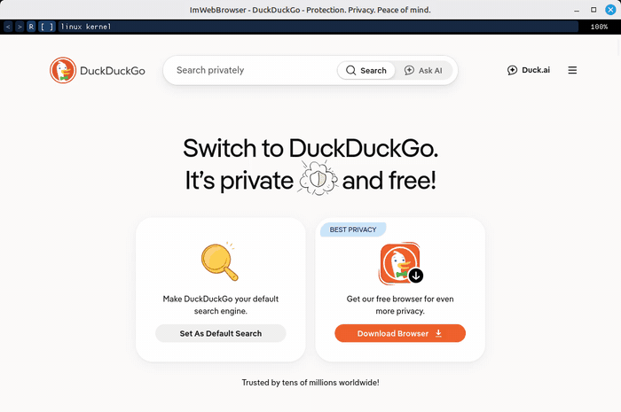

<p align="center">
  
  
  
  
  
</p>

# ImWebBrowser

A lightweight kiosk-grade web browser built on **SDL3 + Dear ImGui + WPE WebKit**
with **zero-copy DMA-buf rendering**, available with two compile-time rendering
backends: **OpenGL ES 3** (default) and **Vulkan**. Frames produced by WebKit's
compositor are imported directly as GPU textures (`EGLImage` in the GLES build,
`VkImage` external-memory import in the Vulkan build) — no CPU copies, no
intermediate buffers.

<p align="center">
  
</p>

| Benchmark (5000 fish, fullscreen 1080p) | FPS |
|---|---|
| Cog (reference WPE launcher) | ~43 |
| **ImWebBrowser kiosk** | **60 (vsync cap)** |

Idle kiosk CPU on a static page: **~5 %** (present-on-demand loop with a 2 ms
idle nap instead of a hot render spin).

## Features

- **Two rendering backends** — OpenGL ES 3 (default) or Vulkan, selected at
  CMake configure time. Both use the same zero-copy frame pipeline.
- **Zero-copy rendering** — WebKit dmabuf frames become GPU textures directly
  (`frame path: dmabuf/EGLImage (zero-copy)`), shared-memory fallback included.
- **Vulkan dma-buf import** (Vulkan build) — frames are imported as `VkImage`s
  via `VK_EXT_external_memory_dma_buf` + DRM-format-modifier tiling; WPE's EGL
  display is pinned to the same GPU as the Vulkan device by matching DRM
  render-node minors.
- **Present-on-demand** — the render loop only presents when a new web frame,
  input, stats or a 150 ms heartbeat requires it; between presents it naps,
  so idle CPU stays near zero without delaying frames or input.
- **Deferred buffer retirement** — the buffer still bound to the texture is
  never recycled mid-present (`retireImage_` pipeline); eliminates striped
  corruption on fast-repainting pages and gives WebKit a deeper buffer queue.
- **Direct kiosk path** — in kiosk mode the UI is skipped entirely: the GLES
  build blits the web texture with a minimal attribute-less triangle, the
  Vulkan build draws it as the sole image on ImGui's background draw list.
- **Kiosk-safe lifecycle** — spurious WM close-requests are ignored in kiosk
  mode; DOM fullscreen enter/exit restores the launch mode.
- **Smart URL bar** — typing `kernel.org`, `/path/file.html` or plain search
  text does the right thing; non-URLs go to DuckDuckGo.
- **Single-view navigation** — `target=_blank` links and `window.open` are
  routed into the existing web view (WebKit's "create" signal), since a second
  view has no draw surface in this embedder.
- **Correct pointer semantics** — WPE button numbers (1=left/2=right/3=middle)
  and held-button bitmasks, matching Cog's input translator.
- Swedish keyboard layout support via system XKB keymap.

## Dependencies

CMake resolves everything through `pkg-config`; the *pkg-config name* column is
the canonical requirement. Versions listed are what the project is developed
and tested against.

### Build-time

| Dependency | pkg-config name | Tested version | Why |
|---|---|---|---|
| [WPE WebKit](https://wpewebkit.org) | `wpe-webkit-2.0` | **≥ 2.53.90** | The browser engine (`WPEBrowser::WebView`) |
| [WPE Backend FDO](https://github.com/Igalia/WPEBackend-fdo) | `wpebackend-fdo-1.0` | 1.16.1 | EGLImage/dmabuf frame export protocol |
| [libwpe](https://github.com/WebPlatformForEmbedded/libwpe) | `wpe-1.0` | 1.16.3 | Generic WPE backend API |
| [SDL3](https://github.com/libsdl-org/SDL) | `sdl3` | 3.4.14 (any ≥ 3.2) | Windowing, input, GL/Vulkan platform |
| libxkbcommon | `xkbcommon` | 1.6.0 | Keyboard mapping (Swedish layout etc.) |
| wayland-server | `wayland-server` | 1.22.0 | Shared-memory frame fallback path |
| EGL | `egl` | 1.5 | Headless EGL display for WebKit (both backends) |
| OpenGL ES *(GLES build)* | `glesv2` | 3.2 | Rendering (blit + ImGui GLES3) |
| Vulkan *(Vulkan build)* | `FindVulkan` / `libvulkan` + headers | loader 1.3.275 | Swapchain present + dma-buf import |
| GLib | *(via WPE WebKit)* | 2.x | Main-loop integration |
| [Dear ImGui](https://github.com/ocornut/imgui) | *vendored* | 1.92.9b | Toolbar/UI — includes `imgui_impl_vulkan` with precompiled SPIR-V, so Vulkan builds need **no shader toolchain** |

Toolchain: **CMake ≥ 3.22**, **pkg-config**, and a **C++20** compiler
(GCC ≥ 11 or Clang ≥ 14).

Debian/Ubuntu package names (where available):

```bash
sudo apt install cmake pkg-config g++ \
    libwpe-1.0-dev libwpebackend-fdo-1.0-dev libxkbcommon-dev \
    libwayland-dev libegl-dev libgles2-mesa-dev libglib2.0-dev

# only for the Vulkan backend:
sudo apt install libvulkan-dev
```

> **SDL3** is not yet packaged for most distros — build it from source
> (`cmake -B build && cmake --build build && sudo cmake --install build`).
>
> **WPE WebKit ≥ 2.53.90** is required for the FDO bridge API this embedder
> uses; if your distro ships an older release, build it per the
> [WPE WebKit instructions](https://wpewebkit.org/release/) (or use the
> prebuilt packages linked there).

### Run-time

| Component | Packages (Debian/Ubuntu names) | Needed for |
|---|---|---|
| GStreamer core + base | `gstreamer1.0-tools gstreamer1.0-plugins-base` | Media framework WebKit links against |
| GStreamer good/bad | `gstreamer1.0-plugins-good gstreamer1.0-plugins-bad` | Most audio/video codecs, v4l2, http srcs |
| GStreamer ugly / libav | `gstreamer1.0-plugins-ugly gstreamer1.0-libav` | H.264, MP3 and other common codecs |
| GPU driver with GLES 3 *(GLES build)* | `mesa-utils` (Mesa: `libgl1-mesa-dri`) | Zero-copy dmabuf import & blit |
| Vulkan driver + loader *(Vulkan build)* | `vulkan-tools` (Mesa: `mesa-vulkan-drivers`) | Swapchain present, dma-buf import |
| Fonts | `fonts-dejavu-core fonts-liberation` | Page text rendering |
| D-Bus accessibility (optional) | `at-spi2-core` | Silences WebKit a11y-bus warnings |

Without GStreamer plugins pages still render, but `<audio>`/`<video>` will not
play. Without a working GLES 3 driver (GLES build) the browser falls back to
CPU-uploaded shared-memory frames (slower but functional).

## Building

```bash
# OpenGL ES 3 backend (default)
# Release (-O3 -DNDEBUG) is the default build type; the -DCMAKE_BUILD_TYPE
# below is optional and only shown for explicitness.
cmake -B build
cmake --build build -j$(nproc)

# Vulkan backend
cmake -B build-vk -DIMWB_BACKEND_VULKAN=ON
cmake --build build-vk -j$(nproc)
```

`-DIMWB_BACKEND_VULKAN=ON` automatically disables the OpenGL ES backend —
exactly one backend is compiled in.

### Choosing a backend

| | OpenGL ES 3 | Vulkan |
|---|---|---|
| Web frame import | `EGLImage` bound to a GL texture | dma-buf → `VkImage` (`VK_EXT_external_memory_dma_buf`) |
| Present path | `SDL_GL_SwapWindow`; kiosk uses an attribute-less blit triangle | swapchain via ImGui's Vulkan renderer (precompiled SPIR-V) |
| Driver requirements | any GLES 3 / Mesa stack | mature Vulkan driver with `VK_EXT_image_drm_format_modifier` |

> **Driver maturity matters for the Vulkan backend.** It was developed and
> verified on Mesa NVK (Kepler). Older/immature drivers may advertise
> `VK_EXT_image_drm_format_modifier` but crash or misrender tiled imports
> (observed on Mesa "hasvk" for Haswell). Modern Intel (Skylake+/ANV), AMD
> (RADV) and NVIDIA (515+) drivers are safe targets.

## CMake compile flags

### Backend selection

| Option | Default | Controls |
|---|---|---|
| `IMWB_BACKEND_OPENGL_ES` | ON | OpenGL ES 3 rendering context (SDL3 GL) |
| `IMWB_BACKEND_VULKAN` | OFF | Vulkan swapchain present + dma-buf `VkImage` import; enabling it disables the GLES backend |

### WebKit engine capabilities

All engine capabilities map 1:1 onto WebKit settings and can be toggled at
configure time. Defaults produce a full-featured browser.

```bash
cmake -B build -DCMAKE_BUILD_TYPE=Release -DENABLE_WEBGL=ON -DENABLE_MEDIA=OFF ...
```

| Option | Default | Controls |
|---|---|---|
| `ENABLE_JAVASCRIPT` | ON | JavaScript execution |
| `ENABLE_WEBGL` | ON | WebGL 3D content |
| `ENABLE_SMOOTH_SCROLLING` | ON | Animated smooth scrolling |
| `ENABLE_PAGE_CACHE` | ON | Back/forward page cache |
| `ENABLE_DNS_PREFETCH` | ON | Speculative DNS resolution |
| `ENABLE_2D_CANVAS` | ON | Accelerated 2D canvas |
| `ENABLE_CARET_BROWSING` | OFF | Moveable text caret without a pointer |
| `ENABLE_SPATIAL_NAVIGATION` | OFF | Arrow-key spatial element navigation |
| `ENABLE_TAB_FOCUS_CYCLE` | ON | Tab key cycles focusable elements |
| `ENABLE_TEXT_AREAS_RESIZE` | ON | Resizable `<textarea>` handles |
| `ENABLE_BF_GESTURES` | OFF | Back/forward swipe gestures |
| `ENABLE_WEBRTC` | ON | WebRTC and getUserMedia (enables WebKit's `enable-webrtc` + `enable-media-stream` settings) |
| `ENABLE_MEDIA` | ON | HTML5 audio/video playback (GStreamer) |
| `ENABLE_AUDIO` | ON | WebAudio API |
| `ENABLE_AUTOPLAY` | OFF | Autoplay media without user gesture |
| `ENABLE_MEDIA_CAPABILITIES` | ON | `navigator.mediaCapabilities` |
| `ENABLE_ENCRYPTED_MEDIA` | ON | Encrypted Media Extensions (DRM) |
| `ENABLE_GSTREAMER` | ON | Require and verify the GStreamer stack |
| `ENABLE_DEVELOPER_EXTRAS` | OFF | WebKit Web Inspector (context-menu) |
| `ENABLE_BENCHMARK_HARNESS` | OFF | Automated WebGL Aquarium benchmark CLI |

`Release` (`-O3 -DNDEBUG`) is the default build type for raw-speed page
rendering; pass `-DCMAKE_BUILD_TYPE=Debug` only when you need symbols — a
debug build renders the same pages several times slower.

### WebRTC backend — decided by the WPE WebKit build

`ENABLE_WEBRTC` only flips WebKit's runtime settings. **Which engine
actually implements `RTCPeerConnection` is chosen when WPE WebKit itself is
built**, via its CMake flag `USE_GSTREAMER_WEBRTC`:

| `USE_GSTREAMER_WEBRTC` (WPE build) | Backend |
|---|---|
| **`ON`** (WPE default) | **GstWebRTC** — media/RTCPeerConnection carried over GStreamer's `webrtcbin` |
| `OFF` | WPE's bundled **libwebrtc** stack |

ImWebBrowser works with either, but **GstWebRTC is the configuration this
project is built against** (the Watermelon-Wine Yocto layer sets
`-DUSE_GSTREAMER_WEBRTC=ON`). That path needs the GStreamer `webrtc`/`rtp`/
`sdp` components (≥ 1.20) and OpenSSL ≥ 3.0, so the runtime image must ship the
matching `gstreamer1.0-plugins-*` packages. `libnice` (GStreamer's ICE library)
covers the actual transport; do not confuse it with the unrelated `librice`
build option which this configuration does **not** use.

> To confirm the running engine exposes GstWebRTC, from the target shell:
> `gst-inspect-1.0 webrtcbin`.

Reference platforms:

- **Linux dev PC** — runs the same `USE_GSTREAMER_WEBRTC=ON` default, so WebRTC
  rides GStreamer's `webrtcbin` here too (falling back to vanilla WebRTC is also
  fine; the app makes no assumption about the engine). Video decode uses whatever
  GStreamer ranks highest (typically software `avdec_h264` on a dev machine).
- **STM32MP257F target** — built for Vulkan + GStreamer in the Watermelon-Wine
  layer (recipes only) so the WebRTC media path can ride the hardware
  (V4L2-stateless H.264 via `v4l2slh264dec`). Give the hardware decoder priority
  before launch with `GST_PLUGIN_FEATURE_RANK="v4l2slh264dec:MAX"` so 1080p
  streamed frames decode on the VPU instead of CPU.

## Running

```bash
./build/imwebbrowser [URL] [--kiosk] [--bench-fish N]      # OpenGL ES build
./build-vk/imwebbrowser [URL] [--kiosk] [--bench-fish N]   # Vulkan build
```

| Argument | Meaning |
|---|---|
| `URL` | Start page (http(s), file://). Defaults to `https://duckduckgo.com`. |
| `--kiosk` | Fullscreen direct-blit mode without toolbar/UI. |
| `--bench-fish N` | Auto-start the WebGL Aquarium benchmark with N fish. |

### Development PC: run inside a nested Weston

WPE renders through a Wayland compositor, so on an X11 desktop the app cannot
open a window directly. `run-native.sh` builds the GLES binary into
`build-native/` and brings up a nested Weston (x11-backend) window that is
torn down again when the browser exits:

```bash
./run-native.sh                                # build (if needed) + run, default page
./run-native.sh https://example.com            # any URL (or --kiosk, --bench-fish N)
./run-native.sh --rebuild                      # force a fresh configure + rebuild
```

The script always rebuilds the sources incrementally before launching, so
after editing `src/` you can simply re-run it — it compiles nothing when
nothing changed.

Inside an existing Wayland session (e.g. the Weston desktop from the Yocto
image) the script skips Weston and launches the browser directly. On an X11
desktop the script needs one extra runtime package over the build
dependencies: `weston` (`sudo apt install weston`). Nothing extra is needed on
the target board.

The launcher sets `SDL_VIDEO_WAYLAND_MODE_EMULATION=0` for the browser. Without
it, SDL3 3.4.14 (as shipped in `/usr/local` on the dev PC) hits a divide-by-zero
`SIGFPE` in `handle_wl_output_done()` while libdecor-gtk drains the
`wl_output.done` queue from the nested Weston, crashing the app shortly after it
maps — which also aborts `center_browser_window()` mid-drag so the window ends
up only partially centred. Mode emulation is purely cosmetic here, so disabling
it is a safe no-op that keeps the libdecor titlebar (so the window is still
draggable by hand) while the window-centring runs to completion.

## Keyboard

| Key | Action |
|---|---|
| `Ctrl+L` | Focus URL bar |
| `Enter` (URL bar) | Navigate / search |
| `Ctrl+R` | Reload · `Ctrl+Shift+R` bypass cache |
| `Alt+Left` / `Alt+Right` | History back / forward |
| `F11` | Toggle kiosk mode |
| `F3` | Stats overlay |
| `Ctrl+W` / `Ctrl+Q` | Quit |

## Environment variables

| Variable | Effect |
|---|---|
| `IMWB_WINDOW_SIZE=WxH` | Force initial window size |
| `IMWB_NOVSYNC` | Disable vsync (benchmarking, tearing possible) |
| `IMWB_STATS` | Per-second `[stats]` line: fps, exports/s, present counts |
| `IMWB_DEBUG_INPUT` | Verbose input logging: every forwarded button/motion/key event |
| `IMWB_DUMP=1` | *(GLES build)* One-shot framebuffer dump to `/tmp/opencode/fb-dump.ppm` |
| `IMWB_VKDUMP=1` | *(Vulkan build)* One-shot swapchain dump to `/tmp/opencode/vk-dump.ppm`, taken after the page has loaded |
| `IMWB_VKLINEAR=1` | *(Vulkan build)* Diagnostic: import frames as stride-based linear instead of DRM-modifier tiling |
| `IMWB_VKGREEN=1` | *(Vulkan build)* Diagnostic: paint a green backdrop under the web layer to check whether it draws |
| `IMWB_MITM_ACCEPT=1` | Send all traffic through a debugging TLS MITM proxy (`http://127.0.0.1:4843`, see `mitm_proxy.py`), ignore TLS errors and whitelist the proxy certificate |

## Architecture

```
SDL3 events ──► main.cpp (routing by geometry) ──► browser.cpp
                                                    │ wpe_input_* events
                                                    ▼
                                            WPE WebKit (WebProcess)
                                                    │ dmabuf frames
                                                    ▼
              browser.cpp updateWebTexture()
                    │
        ┌───────────┴────────────┐
        ▼ GLES build             ▼ Vulkan build
  EGLImage → GL texture    eglExportDMABUFImageMESA → VkImage import
        │                        │ (same GPU, pinned via DRM node)
        ▼                        ▼
  kiosk: blit triangle     ImGui background draw-list image
  windowed: ImGui view           + toolbar / stats overlay
        └───────────┬────────────┘
                    ▼
      SDL_GL_SwapWindow / vkQueuePresentKHR → afterPresent()
```

- `src/main.cpp` — window/backend setup, event loop, geometry-routed input,
  kiosk fast path, benchmark harness.
- `src/browser.cpp/.hpp` — WPE WebKit embedding, zero-copy frame import
  (GL texture binding or dma-buf export), input translation to `wpe_input_*`,
  navigation and load signals.
- `src/vk_backend.cpp/.hpp` — *(Vulkan build)* swapchain presentation and
  external-memory dma-buf import (`VulkanPresent`).
- `src/ui.cpp/.hpp` — Dear ImGui toolbar: URL bar, back/forward/reload,
  progress overlay, stats.

### Vulkan backend notes (hard-won lessons)

- **Same-GPU pinning**: WPE's EGL display is created with
  `eglGetPlatformDisplayEXT(EGL_PLATFORM_DEVICE_EXT)` on the EGL device whose
  DRM render-node minor matches the chosen `VkPhysicalDevice`
  (`VK_EXT_physical_device_drm`). Without this, WebKit may allocate on one GPU
  while the other tries to import — cross-vendor tiled imports crash or misrender.
- **Handle type**: dma-buf fds must be imported as
  `VK_EXTERNAL_MEMORY_HANDLE_TYPE_DMA_BUF_BIT_EXT`. Importing them as
  `OPAQUE_FD` can succeed yet sample black.
- **Buffer recycling**: WebKit recycles exported-image pointers; cached
  dma-buf exports whose fds were already consumed by a previous import are
  re-exported with fresh fds.
- **Aspect**: single-plane formats address subresources via `COLOR`, even under
  DRM-modifier tiling; `MEMORY_PLANE_*` aspects are only for multi-plane (YUV)
  formats.

### Input notes (hard-won lessons)

WPE expects **plain button integers** (1 = left, 2 = right, 3 = middle) plus a
**bitmask of currently pressed buttons** in `state` (`1<<20` left, `1<<21`
right, `1<<22` middle) — *not* Linux `BTN_*` keycodes and not a 0/1 flag.
Motion events must carry the same bitmask so WebKit can track drags.

A click that overlaps a page load can lose its button-up inside the old page;
the embedder re-arms via `markPressHeal()` on every `load-changed` and sends a
synthetic release before the next press.

## Interactive documentation

Open **[`index.html`](index.html)** in any browser — an animated HTML5/WebGL
reference manual with a draggable 3-D render-pipeline model, tooltips on every
public function, live charts and per-module deep dives.
